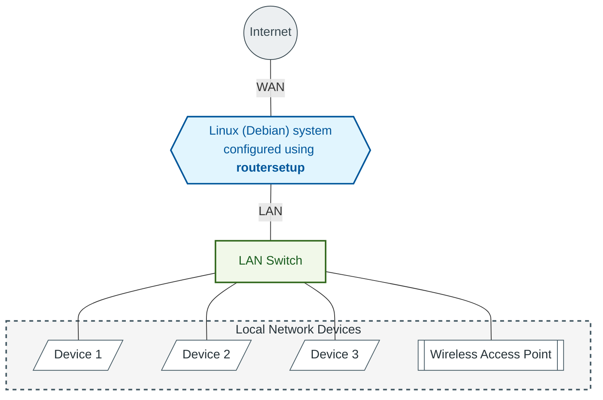

# routersetup

# Table of Contents
* [Overview](#overview)
    * [Core Functionality](#core-functionality)
    * [Installed and Configured Services](#installed-and-configured-services)
    * [Advantages over Consumer and ISP Routers](#advantages-over-consumer-and-isp-routers)
* [Installation](#installation)
    * [Directory Layout](#directory-layout)
    * [Important Warning](#important-warning)
* [Usage](#usage)
    * [Preparing the Script](#preparing-the-script)
    * [Running routersetup](#running-routersetup)
        * [Interface Identification](#interface-identification)
        * [Mandatory Package Installation](#mandatory-package-installation)
        * [Optional Features](#optional-features)
* [Configuration](#configuration)
    * [Mandatory Configuration](#mandatory-configuration)
        * [Configuration: config/iflan-addresses.conf](#configuration-configiflan-addressesconf)
            * [Required Adjustments](#required-adjustments)
        * [Configuration: config/hosts](#configuration-confighosts)
            * [Required Adjustments](#required-adjustments-1)
            * [Additional Recommendations](#additional-recommendations)
        * [Configuration: config/sysctld/92-tcpudp.conf](#configuration-configsysctld92-tcpudpconf)
            * [Adjusting for Systems with less RAM](#adjusting-for-systems-with-less-ram)
        * [Configuration: config/dnscrypt-proxy/dnscrypt-proxy.toml](#configuration-configdnscrypt-proxydnscrypt-proxytoml)
            * [Selecting DNSCrypt Resolvers](#selecting-dnscrypt-resolvers)
        * [Configuration: config/dnsmasq/90-dnsmasq.master.conf and config/dnsmasq/90-dnsmasq-external-dns.master.conf](#configuration-configdnsmasq90-dnsmasqmasterconf-and-configdnsmasq90-dnsmasq-external-dnsmasterconf)
            * [DNS Forwarding Configuration](#dns-forwarding-configuration)
            * [Using External DNS instead of dnscrypt‑proxy](#using-external-dns-instead-of-dnscrypt-proxy)
            * [Adjusting Cache Size](#adjusting-cache-size)
            * [DNS Binding and Firewall Integration](#dns-binding-and-firewall-integration)
            * [DHCPv4 Configuration](#dhcpv4-configuration)
            * [Static DHCPv4 Assignments](#static-dhcpv4-assignments)
            * [DHCPv6 Configuration](#dhcpv6-configuration)
            * [Interaction with ISP‑provided IPv6 prefix](#interaction-with-isp-provided-ipv6-prefix)
            * [SLAAC support](#slaac-support)
            * [Extending the DHCPv6 Range](#extending-the-dhcpv6-range)
            * [External DNS Configuration during dnscrypt‑proxy Setup](#external-dns-configuration-during-dnscrypt-proxy-setup)
        * [Configuration: config/chrony/regional-pool-ntp.sources](#configuration-configchronyregional-pool-ntpsources)
            * [Regional NTP pool examples](#regional-ntp-pool-examples)
            * [Why the iburst Option must be kept](#why-the-iburst-option-must-be-kept)
            * [Stratum Behavior and Offline Operation](#stratum-behavior-and-offline-operation)
            * [Firewall Integration](#firewall-integration)
    * [Optional Configuration](#optional-configuration)
        * [Configuration: config/ddclient/ddclient.conf](#configuration-configddclientddclientconf)
            * [Helper Scripts installed for ddclient](#helper-scripts-installed-for-ddclient)
        * [Configuration: config/slapd/createdb.ldif and config/slapd/initldap.ldif](#configuration-configslapdcreatedbldif-and-configslapdinitldapldif)
            * [createdb.ldif](#createdbldif)
            * [initldap.ldif](#initldapldif)
                * [LDAP Service Account for VoIP Phones](#ldap-service-account-for-voip-phones)
                * [Organizing Contacts into OUs](#organizing-contacts-into-ous)
            * [Adding Contact Entries](#adding-contact-entries)
                * [Example: Yealink‑specific LDAP settings](#example-yealink-specific-ldap-settings)
            * [Maintaining the Phonebook](#maintaining-the-phonebook)
        * [Configuration: config/nftables/nftables.master.conf](#configuration-confignftablesnftablesmasterconf)
            * [Enabling Reverse-Proxy Support](#enabling-reverse-proxy-support)
                * [What these Variables do (Reverse-Proxy)](#what-these-variables-do-reverse-proxy)
                * [Security Considerations (Reverse-Proxy)](#security-considerations-reverse-proxy)
            * [Example: configure a FritzBox to forward Packets to Caddy / copyparty](#example-configure-a-fritzbox-to-forward-packets-to-caddy--copyparty)
            * [Enabling SAT>IP Client Support](#enabling-satip-client-support)
                * [What these Variables do (SAT>IP Client Support)](#what-these-variables-do-satip-client-support)
                * [Security Considerations (SAT>IP Client Support)](#security-considerations-satip-client-support)

# Overview
**routersetup** is a bash script which transforms a Debian- or Ubuntu- based Linux system into a fully functional IPv4/IPv6 dual‑stack router. A minimal hardware configuration – typically two network interfaces designated as WAN and LAN – is sufficient to deploy a working router.

A typical deployment scenario is illustrated below:


## Core Functionality
**routersetup** configures the underlying Linux system to forward packets between WAN and LAN interfaces and installs a curated set of network services required for a modern router. All components are sourced from the Debian / Ubuntu repositories or authoritative upstream maintainers – no proprietary or vendor‑locked technologies are used.

## Installed and Configured Services
Mandatory components:
* **firewall** (nftables) – Provides a stateful, rule‑based packet filter with IPv4/IPv6 support.
* **privacy‑focused DNS resolver** (dnscrypt‑proxy) – Encrypts DNS queries and enforces DNS privacy policies.
* **DHCP client** (dhcpcd) – Manages WAN interface configuration and supports IPv4/IPv6 autoconfiguration.
* **DHCP/DNS server** (dnsmasq) – Supplies LAN clients with IPv4/IPv6 addressing and local DNS caching.
* **NTP server** (chrony) – Ensures accurate system time and provides NTP service to LAN clients.

Optional components:
* **traffic shaping/SQM** (tc) – Implements bandwidth management and bufferbloat mitigation.
* **Dynamic DNS client** (ddclient) – Updates DNS records for dynamic WAN IP addresses.
* **LDAP server** (slapd) – Management of a centralized phonebook for LDAP-enabled (VoIP) phones.

## Advantages over Consumer and ISP Routers
Deploying **routersetup** on general‑purpose hardware provides several operational benefits:
* long‑term software lifecycle – Debian-/ Ubuntu‑ based systems receive security updates for up to a decade.
* higher security posture – Faster patch availability and no vendor‑imposed firmware delays.
* greater feature set – Any additional Linux service can be installed as needed.
* hardware flexibility – Operators may choose NICs, storage, and RAM according to performance requirements.
* superior performance – Commodity PC‑class CPUs typically outperform embedded router SoCs.

While BSD‑based appliances are popular in the firewall space, **routersetup** offers distinct advantages:
* broader hardware compatibility – Linux supports a wider range of modern NICs and offloading features.
* modern network stack – The Linux kernel provides advanced routing, queuing, and offload capabilities.
* full Linux environment – The system is not limited to firewall‑only functionality; any service available in Debian / Ubuntu can be deployed without constraint.

# Installation
**routersetup** is distributed as a standalone directory containing the main script, configuration templates, and supporting libraries. To begin, download the latest release archive and extract it into a working directory.

After unpacking, the directory structure appears as follows:
```
routersetup/
├── bin/  
│   └── routersetup.sh  
├── config/
│   ├── chrony/  
│   ├── ddclient/  
│   ├── …/
│   ├── iflan-addresses.conf  
│   └── hosts
└── lib/
```

## Directory Layout
* *bin/*  
  Contains the primary executable script `routersetup.sh`. This script orchestrates all installation and configuration tasks.
* *config/*  
  Provides configuration templates and service‑specific files used during provisioning. Subdirectories correspond to individual services (e.g., *chrony*, *ddclient*, *dnsmasq*). Additional top‑level files such as `iflan-addresses.conf` and `hosts` define interface addressing and host mappings.
* *lib/*  
  Includes helper functions and support scripts.

## Important Warning
**routersetup performs deep, system‑level modifications** to transform a general‑purpose Debian / Ubuntu installation into a routing appliance. These changes affect:
* network interface configuration
* firewall rules
* DNS/DHCP services
* system daemons
* kernel parameters

Because of the scope of these changes, **misconfiguration or interruption may render the system temporarily or permanently unusable.**

**Before running routersetup, create a complete system backup or snapshot.**

Ensure you have a recovery method (live USB, remote console, or out‑of‑band access) available.

Proceed only if you fully understand the implications of modifying a production system.

# Usage
**routersetup** relies on a set of independent and distribution‑provided software packages. Before executing `routersetup.sh`, all required configuration files must be prepared. For a description of mandatory configuration items see [mandatory configuration](#mandatory-configuration).

If you intend to use optional components such as the Dynamic DNS client or the LDAP server, additional configuration is documented in [optional configuration](#optional-configuration).

**Ensure all configuration files are complete and validated before proceeding.**

## Preparing the Script
Open a terminal and navigate to the *bin/* directory. Confirm that the main script is executable:
```
ls -l routersetup.sh
```
\
If the script does not have the executable bit set, apply it:
```
sudo chmod +x routersetup.sh
```

**routersetup** requires elevated privileges to install packages, write system configuration files, and modify network settings. **During execution, the script will request sudo permissions. These permissions are mandatory for correct operation.**

## Running routersetup
Start the provisioning process by executing:
```
./routersetup.sh
```
or
```
./routersetup.sh -reconfig
```
(this overwrites an existing configuration created with **routersetup**. No backup will be created.)

**routersetup** displays a brief introduction describing its purpose. Press Enter to continue.

### Interface Identification
**routersetup** automatically attempts to detect the WAN interface by inspecting the system’s default route. If the suggested interface is correct, press Enter. If not, manually enter the name of the NIC connected to the upstream network.

Next, **routersetup** proposes a candidate for the LAN interface. Accept the suggestion with Enter, or specify the correct NIC manually.

Once both interfaces are confirmed, **routersetup** begins applying system configuration.

### Mandatory Package Installation
All mandatory components – system configuration, firewall, DHCP services, DNS resolver and NTP – are installed and configured automatically without further user interaction. The script applies the templates found in the *config/* subdirectories and writes the resulting configuration to the system.

### Optional Features
After mandatory provisioning is complete, **routersetup** offers several optional features. Each option is presented interactively:

* **replace system hosts file** – Installs the updated hosts file from *config/hosts*. This is recommended in most deployments because the hosts file must match the addressing defined in *config/iflan-addresses.conf*.
* **shape outgoing traffic (SQM/netQoS)** – Enables traffic shaping for uplinks with limited upload bandwidth (typically \< 500 Mbit/s). The shaper dynamically distributes available bandwidth rather than assigning fixed quotas.\
  You will be prompted to:
    * enter the available **uplink bandwidth** (in Mbit/s)
    * select the **connection type:** cable, DSL, or fiber
* **set up dynamic dns client** – Installs and configures ddclient for environments where the WAN IP address changes and external services must remain reachable. For this feature to work, ensure *config/ddclient/ddclient.conf* is fully configured beforehand.
* **set up ldap server** – Installs and initializes an OpenLDAP server, typically used for centralized VoIP phonebook management or similar directory‑based services.\
  This requires prior configuration of:
    * *config/slapd/createdb.ldif*
    * *config/slapd/initldap.ldif*

# Configuration

## Mandatory Configuration
**Before running routersetup, several configuration files must be adapted to match the target environment.** While many defaults are reasonable, the router’s **LAN addressing** and **hostname** configuration **must be customized.** The following sections describe the required changes.

### Configuration: config/iflan-addresses.conf
***iflan-addresses.conf*** **defines the IPv4 and IPv6 addresses assigned to the router’s LAN interface.** These values determine the addressing scheme for the entire local network.

A sample configuration is included:
```
iflan-ipv6-address=fd64:2e91:427b:0000::1
iflan-ipv4-address=192.168.10.2
iflan-ipv4-cidr=24
lan-suffix=lan
```

#### Required Adjustments
`iflan-ipv6-address` (LAN IPv6 Address)\
This must be a **Unique Local Address (ULA).** ULAs always begin with fd and include a randomly generated 40‑bit identifier: `fdxx:xxxx:xxxx:0000::1`
* The prefix `fdxx:xxxx:xxxx` should be generated randomly.
* The suffix `0000::1` represents the subnet ID and interface ID and must remain unchanged.
* You may use an online ULA generator, but ensure you copy only the prefix and append `:0000::1`.

`iflan-ipv4-address` (LAN IPv4 Address)\
Choose a **private IPv4 address** from one of the following ranges:
* class A: `10.0.0.0 – 10.255.255.255`
* class B: `172.16.0.0 – 172.31.255.255`
* class C: `192.168.0.0 – 192.168.255.255`

Guidelines:
* Do not use `.0` or `.255` as the router’s LAN address.
* Valid host addresses typically range from `.1` to `.254`.

`iflan-ipv4-cidr` (LAN Subnet Size)\
Defines the **subnet mask** for the LAN.\
The default value: `iflan-ipv4-cidr=24` corresponds to a /24 network, allowing host addresses from:\
`192.168.10.1 – 192.168.10.254`

`lan-suffix` (Local Domain Suffix)\
Specifies the **DNS suffix** for LAN hostnames.
* `.lan` is a common, unofficial choice and works well.
* Do not use `.local`, as it is reserved for mDNS and may cause conflicts.

### Configuration: config/hosts
**The *hosts* file must be synchronized with the values defined in *iflan-addresses.conf*.** The default entries look like this:

The corresponding lines are:
```
fd64:2e91:427b:0000::1  router6
192.168.10.2    router
```

#### Required Adjustments
* Replace both IP addresses with the values you configured in `iflan-ipv6-address` and `iflan-ipv4-address`.
* In principle, you may change the hostnames (`router6` and `router`) to any preferred naming scheme.
  However, the hostname set in */etc/hostname* should be present in *hosts* so the system can resolve its own name.
  Assign it to the machine's LAN interface – i.e., replace `router` with the hostname of the system.
* Using different names for IPv4 and IPv6 is recommended to simplify connectivity testing.

#### Additional Recommendations
The *hosts* file is a convenient place to **define fixed-IP infrastructure devices**, such as:
* switches
* Wi‑Fi access points
* upstream routers
* servers with static IPs

When adding such entries:
* **Ensure the IPs do not overlap with DHCP pools** defined in *90-dnsmasq.master.conf* and *90-dnsmasq-external-dns.master.conf*.

### Configuration: config/sysctld/92-tcpudp.conf
**routersetup** applies a set of sysctl parameters that optimize the Linux kernel for high‑performance routing. The resulting system remains usable for light desktop workloads or simple games, but its primary tuning target is router/server operation, not general-purpose desktop use.

The **default configuration** in *92-tcpudp.conf* **assumes a system equipped with 16 GB RAM.** Three kernel memory domains contribute most to RAM usage:

1\. Per‑Socket Buffer Limits (TCP/UDP)\
These parameters define the maximum memory the kernel may allocate per socket. The defaults allow up to 256 MB per socket (128 MB for the receive window and 128 MB for the send window). These ceilings support extremely fast connections – up to \~25 Gbit/s at \~40 ms RTT.

Importantly:
* These values are upper bounds, not preallocated memory.
* Typical connections use far less (autotuning defaults target \~2 MB per socket).

```
# Maximum per-socket buffer sizes (upper autotuning ceiling for TCP/UDP)
net.core.rmem_max                           = 134217728
net.core.wmem_max                           = 134217728

# Initial autotuning targets for TCP/UDP sockets (kernel grows as needed)
net.core.rmem_default                       = 2097152
net.core.wmem_default                       = 2097152
```

TCP autotuning must match these ceilings and defaults:

```
# TCP autotuning: [min] [default] [max]
net.ipv4.tcp_rmem                           = 4096 2097152 134217728
net.ipv4.tcp_wmem                           = 4096 2097152 134217728
```

Syncing the values ensures that TCP autotuning can scale up to the same maximums defined by `rmem_max` and `wmem_max`.

2\. Global TCP Memory Pool\
The global TCP memory pool defines how much RAM the kernel may use across all TCP connections. The default configuration allows the pool to grow up to 6 GB, which corresponds to:
* 6 GB total
* divided by 256 MB per fully maxed-out socket
* ≈ 24 simultaneous fully saturated TCP connections

In practice, even a 25 Gbit/s NIC can only saturate one such connection, so the defaults provide ample headroom.

```
# Global TCP memory limits (in pages, 4 KB each)
# → 2 GB (low) / 4 GB (pressure) / 6 GB (max)
net.ipv4.tcp_mem                            = 524288 1048576 1572864
```

3\. Global UDP Memory Pool\
UDP is stateless, so packets should leave the kernel as quickly as possible. The global UDP memory pool limits the total amount of memory available for UDP buffering.

The default configuration allows up to 2 GB, supporting roughly:
* 2 GB total
* divided by 256 MB per “maxed-out” UDP flow
* ≈ 8 fully saturated UDP flows

This ratio (TCP:UDP ≈ 3:1) is well suited for routers that also provide file‑serving or high‑throughput services.

```
# Global UDP memory limits (in pages, 4 KB each)
# → 512 MB (low) / 1 GB (pressure) / 2 GB (max)
net.ipv4.udp_mem                            = 131072 262144 524288
```

#### Adjusting for Systems with less RAM
**If your system has less than 16 GB RAM, you must scale down the memory limits accordingly:**
* Reduce default per‑socket buffers (`rmem_default`, `wmem_default`).
* Adjust TCP autotuning ranges (`tcp_rmem`, `tcp_wmem`) to match the new ceilings/defaults.
* Reduce global TCP/UDP memory pools (`tcp_mem`, `udp_mem`).

All three must be tuned proportionally to total system RAM.

A practical rule of thumb:
* **Halve all values for an 8 GB system.**
* Ensure `*_default` values remain comfortably below the global memory pool limits.

### Configuration: config/dnscrypt-proxy/dnscrypt-proxy.toml
**routersetup** uses dnscrypt‑proxy to secure DNS traffic by encrypting all DNS queries between the router and upstream resolvers. This prevents ISPs, intermediate networks, or malicious actors from inspecting, logging, or modifying DNS requests. dnscrypt‑proxy supports both DNSCrypt and DoH (DNS‑over‑HTTPS) protocols and allows fine‑grained selection of trusted resolvers.

**The primary configuration task is selecting which upstream DNS resolvers dnscrypt‑proxy should use.** This is controlled through the `server_names` directive in *dnscrypt-proxy.toml*.

```
# server_names = ['scaleway-fr', 'google', 'yandex', 'cloudflare']
server_names = ['adguard-dns', 'adguard-dns-ipv6', 'brahma-world', 'brahma-world-ipv6']
```

Only resolvers listed in `server_names` will be used. All others are ignored, even if they are available in the resolver list.

#### Selecting DNSCrypt Resolvers
dnscrypt‑proxy ships with a built‑in list of vetted, privacy‑respecting resolvers. You can browse the full catalog at: [https://dnscrypt.info/public-servers](https://dnscrypt.info/public-servers)

Each resolver entry includes:
* supported protocols (DNSCrypt, DoH, DoQ)
* IPv4/IPv6 availability
* logging policy
* filtering behavior (e.g., ad blocking)
* geographic location
* DNSSEC support

Recommendations
* Choose at least two resolvers for redundancy.
* Prefer resolvers that support DNSSEC, no‑log policies, and DNSCrypt v2 or DoH.
* If your network uses IPv6, include at least one IPv6‑capable resolver.
* Avoid resolvers operated by organizations you do not trust with metadata.

Example: Mixed IPv4/IPv6 Resolver Set
```
server_names = ['adguard-dns', 'adguard-dns-ipv6', 'brahma-world', 'brahma-world-ipv6']
```

This configuration provides:
* IPv4+IPv6 redundancy
* multiple geographic endpoints
* fallback if one resolver becomes unreachable

### Configuration: config/dnsmasq/90-dnsmasq.master.conf and config/dnsmasq/90-dnsmasq-external-dns.master.conf
dnsmasq provides DNS and DHCP (IPv4+IPv6) services for the LAN. **routersetup configures dnsmasq to forward DNS queries to dnscrypt‑proxy by default**, ensuring encrypted DNS resolution for all LAN clients. The following sections describe how to adjust DNS forwarding, DHCP ranges, and fallback behavior.

#### DNS Forwarding Configuration
By default, dnsmasq forwards all DNS queries to dnscrypt‑proxy:
```
server=127.0.0.1#5354  
server=::1#5354
```

These entries instruct dnsmasq to use the local dnscrypt‑proxy instance listening on port 5354 for both IPv4 and IPv6.

#### Using External DNS instead of dnscrypt-proxy
If you prefer to bypass dnscrypt‑proxy and use external resolvers (e.g., Google DNS), replace the above lines with:
```
server=8.8.8.8
server=8.8.4.4
server=2001:4860:4860::8888
server=2001:4860:4860::8844
```

#### Adjusting Cache Size
**When dnscrypt‑proxy is used, dnsmasq’s DNS cache is disabled:**
```
cache-size=0
```

If **dnscrypt‑proxy is not used**, increase the cache size:
```
cache-size=4096
```

This ensures dnsmasq performs efficient local caching when acting as the primary resolver.

#### DNS Binding and Firewall Integration
**dnsmasq listens only on local and LAN‑facing interfaces.**\
**routersetup**’s default nftables configuration (*config/nftables/nftables.master.conf*) ensures:
* All inbound DNS queries (UDP/TCP port 53\) from LAN clients are redirected to dnsmasq.
* No external host can query dnsmasq from the WAN interface.

This prevents DNS leakage and enforces consistent DNS policy across the LAN.

#### DHCPv4 Configuration
**The DHCPv4 settings in *90-dnsmasq.master.conf* must match the IPv4 addressing defined in *iflan-addresses.conf*.**

If the defaults are used:
```
iflan-ipv4-address=192.168.10.2  
iflan-ipv4-cidr=24
```
then the default DHCPv4 range is appropriate:
```
dhcp-range=192.168.10.100,192.168.10.254,12h
```

Characteristics of the Default Range:

* Provides 155 dynamic IPv4 leases (.100 \- .254)
* Leaves .1 \- .99 available for static assignments
* Avoids .0 and .255, which must not be used as host addresses

#### Static DHCPv4 Assignments
Static hosts are defined in the section:
```
# ***********************************************
# ******* ADD YOUR STATIC DHCP HOSTS HERE *******
# ***********************************************
```

Example:
```
dhcp-host=00:1F:2E:3D:4C:5B,my1stdevice,192.168.10.10,12h
```

This assigns:
* MAC address → `00:1F:2E:3D:4C:5B`
* Hostname → `my1stdevice`
* IPv4 → `192.168.10.10`
* lease time → `12` hours

Client can then be reached via:
* `192.168.10.10`
* `my1stdevice`
* `my1stdevice.lan` (if `lan-suffix=lan`)

#### DHCPv6 Configuration
**dnsmasq also provides DHCPv6 services.** The default configuration:
```
dhcp-range=::100, ::1ff, constructor:IFLAN, slaac, ra-names, 64, 12h
```

Behavior of the Default DHCPv6 Range\
Assuming:
```
iflan-ipv6-address=fd64:2e91:427b:0000::1
```

dnsmasq will lease IPv6 addresses from:
```
fd64:2e91:427b:0000::100 - fd64:2e91:427b:0000::1ff
```

#### Interaction with ISP-provided IPv6 prefix
**routersetup** uses dhcpcd to request a local and public IPv6 prefix.
As a result, each LAN device receives:

* a ULA (from the *config/iflan-addresses.conf* prefix)
* a GUA (from the ISP prefix)[^1]

This dual‑addressing model is standard for IPv6 deployments.

#### SLAAC support
Devices that do not support DHCPv6 (e.g., Android) will still obtain a valid ULA and GUA via SLAAC.

**dnsmasq’s `slaac` and `ra-names` options ensure smooth coexistence of DHCPv6 and SLAAC.**

#### Extending the DHCPv6 Range
To expand the pool to 768 addresses:
```
dhcp-range=::100, ::3ff, constructor:IFLAN, slaac, ra-names, 64, 12h
```
[^2]

Explanation of Key Options
* `constructor:IFLAN` – Derives the prefix from the LAN interface (ULA+GUA).
* `slaac` – Enables SLAAC for clients that prefer it.
* `ra-names` – Attempts to map SLAAC clients to hostnames.
* `64` – prefix length; required for SLAAC, do not modify\!
* `12h` – lease duration

#### External DNS Configuration during dnscrypt-proxy Setup
During dnscrypt‑proxy installation, dnscrypt‑proxy is not yet available for DNS resolution. To avoid a bootstrap deadlock, **routersetup** temporarily activates:
*config/dnsmasq/90-dnsmasq-external-dns.master.conf*

This configuration uses external DNS resolvers (Google DNS by default). In addition, it does not set the `cache-size` to `0` (as dnsmasq is responsible for DNS caching in this configuration).\
Otherwise, make sure that *90-dnsmasq-external-dns.master.conf* matches *90-dnsmasq.master.conf*.

### Configuration: config/chrony/regional-pool-ntp.sources
**routersetup** installs chrony as the local NTP server for the LAN. chrony synchronizes the system clock with upstream time sources and then provides accurate time to all LAN clients. The upstream servers used by chrony are defined in:\
*config/chrony/regional-pool-ntp.sources*[^3]

**By default, the configuration uses the Europe NTP pool:**
```
pool 0.europe.pool.ntp.org iburst
pool 1.europe.pool.ntp.org iburst
pool 2.europe.pool.ntp.org iburst
pool 3.europe.pool.ntp.org iburst
```

**If your router is deployed in a different region, you should update these entries to use the geographically closest NTP pool.** Closer servers generally provide lower latency, faster convergence, and more stable synchronization.

#### Regional NTP pool examples
North America
```
pool 0.north-america.pool.ntp.org iburst
pool 1.north-america.pool.ntp.org iburst
pool 2.north-america.pool.ntp.org iburst
pool 3.north-america.pool.ntp.org iburst
```

Asia
```
pool 0.asia.pool.ntp.org iburst
pool 1.asia.pool.ntp.org iburst
pool 2.asia.pool.ntp.org iburst
pool 3.asia.pool.ntp.org iburst
```

Other available regional pools
```
0-3.africa.pool.ntp.org
0-3.oceania.pool.ntp.org
0-3.south-america.pool.ntp.org
```

#### Why the iburst Option must be kept
The `iburst` directive instructs chrony to send a short burst of packets when first contacting a server. This dramatically accelerates initial synchronization:
* Without `iburst`: first sync may take several minutes.
* With `iburst`: chrony typically locks onto a stable time source within 1 \- 5 seconds.

This is especially important for routers, which must provide accurate time to LAN clients immediately after boot.

#### Stratum Behavior and Offline Operation
**routersetup** configures chrony as a stratum 10 time source. This ensures:
* chrony is clearly marked as a local time provider.
* LAN clients can synchronize reliably.
* chrony will always prefer upstream internet servers (stratum 1–3) when available.

If the WAN connection goes down:
* chrony continues serving time based on the local hardware clock.
* LAN devices remain synchronized.
* chrony automatically re‑synchronizes with upstream servers once connectivity returns.

This provides stable time service even during outages.

#### Firewall Integration
chrony listens only on:
* the local interface
* the LAN‑facing interface

**routersetup**’s default nftables configuration (*config/nftables/nftables.master.conf*) ensures:
* NTP requests (UDP port 123\) from LAN clients are redirected to the local chrony instance.
* NTP traffic from the WAN is blocked.
* The router does not act as a public NTP server.

This prevents abuse and ensures chrony is used exclusively by trusted LAN devices.

## Optional Configuration
optional changes to configuration files are explained here.

### Configuration: config/ddclient/ddclient.conf
**routersetup** includes ddclient, a lightweight Perl-based daemon used to update Dynamic DNS (DDNS) records. DDNS is essential when your ISP assigns a dynamic public IP address, because services hosted on your router would otherwise become unreachable whenever the IP changes.

ddclient solves this by:
* monitoring the router’s current public IPv4/IPv6 address,
* detecting when the address changes,
* updating the DNS record at your DDNS provider so your hostname (e.g., myhome.dyndns.org) always points to the correct IP.

The configuration file *config/ddclient/ddclient.conf* contains example configurations for many DDNS providers. To configure ddclient:
1. Locate the example block for your provider.
2. Copy it, paste it below, and uncomment it.
3. Fill in your provider‑specific settings (username, password, hostname, etc.).

Your DDNS provider’s documentation usually includes the exact parameters required.

#### Helper Scripts installed for ddclient
**routersetup** installs two helper scripts into:
`/usr/local/bin`

These scripts provide (support for) reliable IP detection for ddclient, especially on dual‑stack (IPv4+IPv6) WAN connections.

`network-connected.sh [timeout] [mode] [interface]`\
This script waits until the WAN interface has obtained a global IPv4 and/or IPv6 address.

Arguments:
* `timeout` – maximum seconds to wait (default: `60`)
* `mode` – which IP address types to wait for:
    * `ipv4`
    * `ipv6`
    * `dual` (default; waits for both IPv4 and IPv6)
* `interface` – interface to check (default: the WAN interface selected in **routersetup**)

**`network-connected.sh` is run during startup of dnsmasq.service and ddclient.service. It must not be deleted.**

`get-ip6-from-ifwan.sh`\
This script prints the global IPv6 address assigned to the WAN interface.  
It is especially useful because ddclient often requires an explicit command to retrieve the IPv6 address reliably.

To use this script with ddclient, replace the web based IPv6 address check, i.e.:
```
usev6=webv6, webv6='checkipv6.dedyn.io'  
```
with:
```
usev6=cmdv6, cmdv6='/usr/local/bin/get-ip6-from-ifwan.sh'
```
This ensures ddclient always uses the router’s actual WAN IPv6 address instead of relying on external “what is my IPv6” services.

Additional Notes:
* ddclient also supports command‑based IPv4 detection.\
  Examples are available in the official repository:
  [https://github.com/ddclient/ddclient](https://github.com/ddclient/ddclient)
* If your DDNS provider supports IPv6, ensure both `usev4` and `usev6` are configured correctly.
* ddclient runs as a systemd service and automatically updates DNS records whenever the WAN IP changes.

### Configuration: config/slapd/createdb.ldif and config/slapd/initldap.ldif
**routersetup** includes optional LDAP support intended for centrally managed phonebooks used by VoIP phones. The LDAP configuration consists of two LDIF files:
* *createdb.ldif* – Defines and creates the LDAP database used for the phonebook.
* *initldap.ldif* – Populates the database with organizational units, service accounts, and contact entries.

**Both files must be edited carefully to maintain valid LDIF syntax.**

#### createdb.ldif
*createdb.ldif* defines the OpenLDAP database that stores the phonebook. It is processed as one single LDIF entry, so:  
**Do not include empty lines.** In LDIF syntax, an empty line terminates the current entry.

Database Size\
The default configuration includes:
```
olcDbMaxSize: 33554432
```
This allocates 32 MB for the LMDB backend, which is sufficient for approximately 1000 contact records. Increase this value if you expect a larger directory.

Root DN Password\
The database requires an administrative password for `olcRootDN`. Generate a secure password hash using: slappasswd

Then copy the resulting hash into:
```
olcRootPW: {SSHA}...
```
Notes:
* **Never** use a plaintext password in `olcRootPW`.
* If slappasswd is missing, install it via:  
  `sudo apt install slapd`

#### initldap.ldif
*initldap.ldif* populates the phonebook with:
* the base directory structure
* the LDAP service account used by VoIP phones
* organizational units (OUs)
* contact entries

As with *createdb.ldif*:\
**Do not insert empty lines inside a single record.**  An empty line indicates the start of a new LDIF entry.

##### LDAP Service Account for VoIP Phones
VoIP phones require an LDAP bind account. **routersetup** provides:
```
dn: uid=ldapphone,o=phonebook,dc=router,dc=lan
```

This entry contains:
`userPassword: {SSHA}...`\
Generate the password hash with: slappasswd

The **unhashed password** is what you enter into the VoIP phone’s configuration interface.

Example (Yealink phones)
```
LDAP Username: uid=ldapphone,o=phonebook,dc=router,dc=lan
LDAP Password: <plaintext password>
```

##### Organizing Contacts into OUs
Contacts can be grouped into organizational units. The sample configuration uses:
`ou=privatecontacts,o=phonebook,dc=router,dc=lan`

To make Yealink phones search this OU:
```
LDAP Base: ou=privatecontacts,o=phonebook,dc=router,dc=lan
```

#### Adding Contact Entries
Contacts are defined as LDIF entries separated by one empty line. A sample contact is included in *initldap.ldif*.

**Required Attributes**\
The inetOrgPerson object class requires:
* cn (common name)
* sn (surname)

These must be present for every contact.

**Recommended Attributes**\
Optional but useful fields include:
* displayName
* description
* homePostalAddress
* homePhone
* mobile
* telephoneNumber
* mail

These attributes improve phonebook usability, especially for VoIP devices.

##### Example: Yealink-specific LDAP settings
To ensure Yealink phones interpret the directory correctly:

Display Name
```
LDAP Display Name: %displayName
```

Name Attributes
```
LDAP Name Attributes: cn sn displayName
```

Number Attributes
```
LDAP Number Attributes: telephoneNumber mobile homePhone
```

Search Filters
```
LDAP Name Filter: (|(cn=%)(sn=%)(displayName=%))
LDAP Number Filter: (|(telephoneNumber=%)(mobile=%)(homePhone=%))
```

Connection Properties
```
LDAP TLS Mode: LDAP
LDAP Server Address: <router hostname>
Port: 389
```

#### Maintaining the Phonebook
**routersetup** includes a helper script:
*lib/reimport.sh*[^4]

This script:
* deletes the existing LDAP phonebook database
* reimports all entries from *initldap.ldif*

This workflow is ideal when:
* adding new contacts
* removing outdated entries
* reorganizing OUs
* bulk‑editing the phonebook

It is significantly faster and simpler than re-running:
```
routersetup -reconfig
```
and avoids the complexity of modifying individual LDAP entries with ldapadd, ldapmodify, or ldapdelete.

### Configuration: config/nftables/nftables.master.conf
**routersetup** uses nftables as its firewall. The active ruleset is generated from:\
*config/nftables/nftables.master.conf*

During installation, **routersetup** substitutes all variables defined in the:
```
# --- Variables ---
```
section to produce the final */etc/nftables.conf*.

The default nftables configuration is prepared for systems that act as:
* a LAN router with strict WAN isolation
* optional: a reverse-proxy for a file server (e.g., using Caddy as reverse proxy and copyparty as file server)
* optional: a client for WAN-based SAT>IP servers using UDP/RTSP to transmit broadcast signals (DVB)

**Reverse-Proxy and SAT>IP Client Support is disabled by default but can be enabled by adjusting variables.**

#### Enabling Reverse-Proxy Support
In the default configuration, the relevant lines are:
```
define caddy_verdict = handle_reject  # set to caddy_rules to enable Caddy port
define caddy_port = 443
```

To enable reverse‑proxy functionality, change them to:
```
define caddy_verdict = caddy_rules  # set to handle_reject to disable Caddy port
define caddy_port = <matching Caddy port>
```

##### What these Variables do (Reverse-Proxy)
`caddy_verdict` – This variable controls which nftables chain handles inbound HTTP(S) traffic:
* `handle_reject`
    * default behavior
    * all inbound HTTP(S) traffic from the WAN is rejected
    * the router does not expose any public services
* `caddy_rules`
    * enables the reverse‑proxy chain
    * inbound HTTP(S) traffic is passed to Caddy
    * Caddy can then forward requests to internal services (e.g., copyparty, local web apps)

This design ensures that enabling or disabling public‑facing services is a single‑line change, reducing the risk of misconfiguration.

`caddy_port` – This defines the port where Caddy listens for incoming HTTP(S) traffic.

Typical values:

* `443` – standard HTTPS (ports 0-1023 are privileged ports, requiring root privileges to use)
* `8443` – alternative HTTPS port
* `custom port` – if Caddy is bound behind another service or container

The nftables rules will accept WAN HTTP(S) traffic for this port.

##### Security Considerations (Reverse-Proxy)
* When `caddy_verdict = handle_reject`, the router is not reachable from the internet on `caddy_port`.
* When `caddy_verdict = caddy_rules`, the router becomes a public HTTP(S) endpoint.
* Ensure Caddy is properly configured with:
    * TLS certificates (ACME / Let’s Encrypt)
    * rate limiting (if needed)
    * authentication for sensitive services
    * correct upstream definitions

**routersetup does not automatically configure Caddy**; it only prepares the firewall to support it.

#### Example: configure a FritzBox to forward Packets to Caddy / copyparty
1. Open **Internet → Permit Access → Port Sharing**.
2. Click **Add Device for Sharing**.
3. Select **Device** – the router configured with **routersetup**.
    * **IPv4 address** and **MAC address** are pre‑filled and read‑only.
4. Run `get-ip6-from-ifwan.sh` on the router and note the **IPv6 Interface ID** (the last four hex blocks of the WAN IPv6 address).
5. Disable all checkboxes except **Enable PING6**.
6. Click **New Sharing → Port Sharing**.
    * Application: **Other application**
    * Name: **copyparty\_wan\_tcp**
    * Protocol: **TCP**
    * Port to device / through…: `caddy_port` (e.g., `8443`)
    * Port requested externally: `caddy_port` (e.g., `8443`)
    * Enable sharing: **checked**
    * Internet access via: **IPv4 and IPv6**
    * Click **OK**
7. Repeat the previous step to create the UDP rule (for QUIC):
    * Name: **copyparty\_wan\_udp**
    * Protocol: **UDP**
    * Same port settings as above
8. Click **Apply** to activate the configuration.

This creates four rules in total:  
Two for copyparty\_wan\_tcp (IPv4 \+ IPv6) and two for copyparty\_wan\_udp (IPv4 \+ IPv6).

#### Enabling SAT>IP Client Support
Enable this configuration **only** for WAN-based SAT>IP servers. LAN-based servers are supported by default.

See the following lines in the default configuration:
```
define satip_verdict = handle_reject        # set to satip_rules to enable DVB streaming
define satip_servers = { 192.168.178.1 }    # IPv4 of SAT>IP server
define satip_ports = 5556-5599              # ports used for DVB streaming
```

To enable SAT>IP Client Support, change them to:
```
define satip_verdict = satip_rules          # set to handle_reject to disable DVB streaming
define satip_servers = { [IPv4 address of SAT>IP server], [IPv4 address of SAT>IP server], ... }
define satip_ports = <UDP/RTSP port range used for DVB streaming>
```

##### What these Variables do (SAT>IP Client Support)
`satip_verdict` – This variable controls which nftables chain handles inbound UDP/RTSP traffic:
* `handle_reject`
    * default behavior
    * unsolicited UDP/RTSP traffic from SAT>IP server(s) is rejected
* `satip_rules`
    * opens `satip_ports` for incoming (autonomous) UDP/RTSP streams from SAT>IP server(s)
    * allows SAT>IP clients (such as Tvheadend) to receive media streams on these ports
* `satip_servers` – comma-separated IPv4 whitelist of allowed SAT>IP source host(s).
Only traffic from these host(s) is allowed to be received on `satip_ports`.
* `satip_ports` – inbound UDP port range for streaming media. Must start on an even port and end on an odd port
(requires even/odd RTP/RTCP port pairs).

##### Security Considerations  (SAT>IP Client Support)
* When `satip_verdict = handle_reject`, the router blocks unsolicited traffic from the internet on `satip_ports`.
* When `satip_verdict = satip_rules`, the router can receive SAT>IP streams from `satip_servers` on `satip_ports` only.
* Tvheadend alignment: match `satip_ports` to **Configuration → General → Ports settings → RTSP UDP minimum / maximum port**.

**routersetup provisions nftables ingress rules only**; it does not deploy or configure SAT>IP client software.

[^1]:  FritzBox users: in **Home network → Network → Network Settings → Change Advanced Network Settings → IPv6**, activate **Enable DHCPv6 server in the FRITZ\!Box for the home network** with the option: **Assign DNS server, prefix (IA\_PD) and IPv6 address (IA\_NA)** to receive a GUA prefix. Accept double NAT instead of FritzBox modem mode to take advantage of the 2.5 GBit Ethernet port (if available).

[^2]:   by default, 1\) dnsmasq is configured to support up to 1024 DHCP leases (shared v4/v6). To change, update `dhcp-lease-max=1024` accordingly. 2\) the IPv6 neighbour table in */config/sysctld/90-sysctl-net.conf* is configured for up to 1024 DHCPv6 managed leases. If more leases are required, change `net.ipv6.neigh.default.gc_thresh1`, `net.ipv6.neigh.default.gc_thresh2`, `net.ipv6.neigh.default.gc_thresh3` to number of leases \*2, \*4, \*8.

[^3]:  depending on the Linux distribution, *regional-pool-ntp.sources* may not be the only file considered for upstream time sources.

[^4]:  `reimport.sh` needs to be run from the *lib/* folder as it expects **routersetup**’s config directory being accessible via *\.\./config*.
